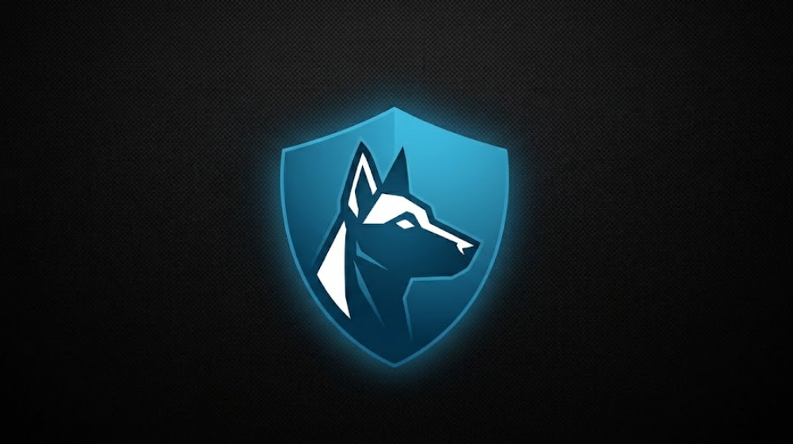

<p align="center">
  
</p>

# 🛰️ WATCHDOC

> AI-Native Code Governance Protocol System

[](https://github.com/JackyChai311/WatchDoc)
[](LICENSE)
[](https://www.python.org)

**WatchDoc** — An AI-native code governance protocol that embeds self-protection directly into your source code. Using lightweight inline markers (`@wd:`), WatchDoc gives every module its own independent "watchdog" with clear guard levels (FREEZE, GUARD, AUDIT, NONE). It transforms chaotic AI-driven refactoring into a **structured, auditable process** with impact analysis, temporary human-authorized access, and automatic safeguards — greatly reducing the risk of over-refactoring, silent logic changes, and context amnesia.

---

## 📖 Examples

See the [examples/](examples/) directory for:
- Payment processor with WDP markers
- Attack simulation test
- Real-world usage patterns

---

### Protection Model

WatchDoc uses a **hybrid approach**:

- **Decentralized & Embedded (WDP)**: Protection rules live directly inside your code as simple comment markers. These rules travel with the codebase — even when forked or shared across teams.
- **Centralized Governance (WGW)**: Temporary authorizations, impact analysis, audit trails, and emergency overrides are managed through the WatchDoc CLI and manifest.

**Key Strength**  
WatchDoc turns passive guidance ("please don't change this") into an **active protocol** that the AI is expected to follow:
- Detect `@wd:` markers
- Perform impact analysis before editing
- Request temporary authorization for protected modules
- Wait for explicit human confirmation

This significantly improves compliance compared to traditional rules files (Cursor Rules, CLAUDE.md, etc.).

**Important Note on Enforcement**  
WatchDoc provides **strong procedural enforcement** through structured markers, guard levels, assertions, time-bound grants, and audit logging. However, it is not a hard runtime lock. 

Protection works best when the LLM is instructed to strictly follow the protocol (via the provided skill/system prompt). In long sessions or aggressive refactors, models may still attempt to bypass markers — human review and post-edit verification remain essential parts of the workflow.

**🔒 Post-Edit Verification (New in v1.1)**  
Even if AI ignores the protocol, WatchDoc now provides a **safety net** through Git pre-commit hooks:

- **Automatic verification** on every `git commit`
- **AST-based detection** of unauthorized modifications
- **Three-tier enforcement**: FREEZE (block), GUARD (validate), AUDIT (warn)
- **Bypass-resistant** - Protection works even without AI cooperation

See [Post-Edit Verification](#-post-edit-verification) section below.

---

## ✨ Features

### 🔒 WDP Protocol (Watchdoc Description Protocol)
- **Inline protection markers** - Embed protection rules directly in code comments
- **Multi-language support** - 18+ languages (Python, JavaScript, TypeScript, Java, Go, Rust, C/C++, Ruby, PHP, Swift, Kotlin, etc.)
- **Auto-freeze initialization** - Automatically mark all functions as FREEZE on first run

### 🐕 Independent Watchdocs
- **Module-level granularity** - Each function/module has its own protection
- **Four guard levels** - FREEZE, GUARD, AUDIT, NONE
- **Assertion rules** - Signature_Lock, Complexity_Limit, Test_Linked, and more

### 🎯 Two-Phase Intelligent Workflow
- **Phase 1: Initialization** - Auto-scan all code, FREEZE everything, generate inventory for human approval
- **Phase 2: Modification** - AI analyzes impact, lists modules, human confirms before execution
- **Temporary Authorization** - 30-minute time-bound access for FREEZE modules

### 🔐 Temporary Authorization Mechanism
- **Time-bound access** - 30-minute validity period, automatic reclamation
- **Topic switch detection** - Automatically revoke when user switches topics
- **Audit trail** - All authorizations and modifications are logged

### 🚨 Emergency Override
- **Three-level approval** - Single, Dual, Admin
- **Time-bound access** - Configurable duration (default 24 hours)
- **Usage limits** - Prevent abuse of emergency privileges

### 🔒 Post-Edit Verification (New in v1.1)
- **Git pre-commit hooks** - Automatic verification on every commit
- **AST-based detection** - Detect unauthorized code modifications
- **Three-tier enforcement** - FREEZE (block), GUARD (validate), AUDIT (warn)
- **Manual verification** - Run `watchdoc verify` anytime

**Guard Levels**

| Level   | Description                  | Modification Allowed                          | Protection Style          |
|---------|------------------------------|-----------------------------------------------|---------------------------|
| FREEZE  | Core / critical logic        | Requires temporary authorization              | Strong (preventive)       |
| GUARD   | Important logic              | Restricted + must satisfy assertions          | Medium                    |
| AUDIT   | Normal logic                 | Allowed with audit note                       | Light                     |
| NONE    | Utility / navigation         | No restrictions                               | None                      |

*Note: FREEZE level provides the strongest protection, but still relies on the AI following the protocol and human approval.*

---

## 🚀 Quick Start

### Option A: Install via pip (Recommended)

```bash
# Install from PyPI (coming soon)
# pip install watchdoc

# Install from source
git clone https://github.com/JackyChai311/WatchDoc.git
cd WatchDoc
pip install -e .

# Initialize your project
watchdoc init /path/to/your/project --auto-freeze
```

### Option B: Use as IDE Skill

```bash
# 1. Clone or download
git clone https://github.com/JackyChai311/WatchDoc.git

# 2. Add to your AI-powered IDE (Cursor, Windsurf, etc.)
#    Navigate to Skills/Plugins settings and add: WatchDoc/watchdoc-publish/skill/

# 3. Deploy
#    Just tell your AI assistant: "Deploy WatchDoc"
```

The AI will automatically:
- Install required dependencies (pyyaml)
- Initialize your project with auto-freeze protection
- Generate the protection manifest

### Option C: Command Line Usage (from source)

```bash
# Clone repository
git clone https://github.com/JackyChai311/WatchDoc.git
cd WatchDoc

# Install in development mode
pip install -e .

# Initialize project
watchdoc init /path/to/your/project --auto-freeze
```

**Output:**
```
✅ Auto-marking complete!
   - Files scanned: 45
   - Functions marked: 237

📊 Language breakdown:
   - python: 89 functions
   - javascript: 67 functions
   - go: 45 functions

✅ Initialization complete: 237 modules indexed
```

```bash
# 2. Review protection inventory
cat /path/to/your/project/.watchdoc/manifest.md

# 3. Scan for impact before modification
watchdoc scan /path/to/project --intent "Modify payment timeout logic"

# 4. Grant temporary authorization (if FREEZE modules affected)
watchdoc grant /path/to/project \
  --module-id=payment_setTimeout \
  --level=AUDIT \
  --reason="Modify payment timeout logic"

# 5. Modify code (with AI assistance)

# 6. Revoke authorization (when topic changes)
watchdoc revoke /path/to/project
```

---

## 📖 How It Works

### Two-Phase Workflow

```
┌─────────────────────────────────────────────────────────┐
│           Phase 1: Initialization (First Time)           │
└─────────────────────────────────────────────────────────┘

1. Run: watchdoc init /path/to/project --auto-freeze
2. All functions automatically marked as FREEZE
3. Review .watchdoc/manifest.md
4. Adjust protection levels (FREEZE/GUARD/AUDIT/NONE)

┌─────────────────────────────────────────────────────────┐
│            Phase 2: Modification (Daily Use)             │
└─────────────────────────────────────────────────────────┘

1. User: "I want to modify payment timeout logic"
2. AI: Analyzes impact, lists affected modules
3. AI: Requests temporary authorization for FREEZE modules
4. User: Confirms authorization (AUDIT/GUARD/NONE)
5. AI: Executes modification within authorized scope
6. AI: Verifies changes, records audit log
7. System: Automatically reclaims authorization after 30 min
```

### WDP Marker Syntax

```javascript
// @wd: payment-core | Role: Core | Guard: FREEZE | Entry: processPayment | Summary: "Core payment logic - DO NOT MODIFY"
// @wd-assert: Signature_Lock
// @wd-assert: Test_Linked: test-file:tests/payment.test.js
function processPayment(amount, cardInfo) {
    // Core payment logic here
    // AI sees the @wd: FREEZE marker and knows: DON'T TOUCH THIS!
}
// @wd: payment-core | END
```

### Guard Levels

| Level | Description | Modification Allowed |
|-------|-------------|---------------------|
| **FREEZE** | Core assets, frozen | ❌ No modification (requires temporary authorization) |
| **GUARD** | Critical logic, contract protected | ⚠️ Restricted, must satisfy assertions |
| **AUDIT** | Normal logic, change tracking | ✅ Allowed, but requires note |
| **NONE** | Navigation only | ✅ Full access |

### Temporary Authorization Levels

| Level | Meaning | Validity |
|-------|---------|----------|
| **AUDIT** | Allow modification, record audit log | 30 minutes |
| **GUARD** | Allow modification, warn before modification | 30 minutes |
| **NONE** | Allow free modification | 30 minutes |

---

## 🌐 Architecture

```
watchdoc/
├── wdp/          # Watchdoc Description Protocol
│   ├── parser.py      # Marker parser
│   ├── auto_marker.py # Auto-freeze scanner
│   └── verifier.py    # Code verifier
├── wgw/          # Watchdoc Gateway
│   ├── manifest.py     # Manifest management
│   ├── authorization.py # Authorization system
│   ├── temporary_grant.py # Temporary authorization (30-min)
│   └── override.py     # Emergency override
├── hooks/        # Post-Edit Verification (NEW in v1.1)
│   └── pre_commit.py   # Git pre-commit hook verifier
├── index/        # Impact Analysis
│   └── analyzer.py     # A/B/C classification
└── cli/          # Command-line interface
    └── main.py        # CLI entry point (includes 'verify' command)
```

---

## 🔧 CLI Commands

### Initialization

```bash
# Initialize with auto-freeze (all functions marked as FREEZE)
watchdoc init /path/to/project --auto-freeze
```

### Scanning & Analysis

```bash
# Scan for impact analysis
watchdoc scan /path/to/project --intent "Modify payment logic"

# Detect code drift
watchdoc drift /path/to/project

# Reindex project
watchdoc reindex /path/to/project
```

### Temporary Authorization

```bash
# Grant temporary authorization
watchdoc grant /path/to/project \
  --module-id=payment_setTimeout \
  --level=AUDIT \
  --reason="Modify payment timeout logic"

# Check session status
watchdoc session /path/to/project

# Revoke all authorizations
watchdoc revoke /path/to/project
```

### Emergency Override

```bash
# Create override request
watchdoc override \
  --user-id alice --email alice@company.com \
  --scope-type directory --pattern src/payment/ \
  --reason "Emergency payment bug fix" --level dual

# Approve override request
watchdoc approve \
  --request-id OVR-20240402-0001 \
  --user-id bob --email bob@company.com \
  --decision approve
```

### Post-Edit Verification

```bash
# Manual verification
watchdoc verify /path/to/project

# Verify specific file
watchdoc verify /path/to/project --file src/payment.py

# Verbose output
watchdoc verify /path/to/project --verbose
```

---

## 🔒 Post-Edit Verification

Even if AI ignores the protocol, WatchDoc provides a **safety net** through Git pre-commit hooks.

### Setup (One-time)

```bash
# Copy pre-commit hook to your project
cp /path/to/WatchDoc/scripts/hooks/pre-commit .git/hooks/
chmod +x .git/hooks/pre-commit

# Now every commit will be verified!
```

### What It Checks

| Check | Description | Action |
|-------|-------------|--------|
| **FREEZE Modules** | Detects unauthorized modifications | ❌ **Block commit** |
| **GUARD Assertions** | Validates signature locks, complexity limits | ⚠️ **Warn but allow** |
| **AUDIT Notes** | Checks if modification has audit note | ℹ️ **Warn only** |

### Example Output

```
🔍 Running WatchDoc pre-commit verification...

❌ WDP VIOLATIONS DETECTED:
   🔒 FREEZE module 'payment_processPayment' was modified without authorization

🚫 Commit blocked due to WDP violations.
   Grant temporary authorization or revert changes.
```

### How It Works

1. **AST-based Detection** - Extracts function definitions and calculates content hashes
2. **Hash Comparison** - Compares current code against protected manifest
3. **Violation Detection** - Identifies unauthorized modifications to FREEZE/GUARD modules
4. **Automatic Blocking** - Prevents commits that violate WDP rules

### Bypass Scenarios

The pre-commit hook can be bypassed if:
- User has active temporary authorization (via `watchdoc grant`)
- User uses `git commit --no-verify` (not recommended)

See [Post-Edit Verification Docs](docs/POST_EDIT_VERIFICATION.md) for detailed implementation.

---

## 📚 Documentation

- 📖 [Whitepaper](docs/WHITEPAPER.md) - Complete technical whitepaper
- 📖 [WDP Protocol Specification](docs/WDP.md) - Marker protocol reference
- 📖 [WGW Governance Protocol](docs/WGW.md) - Governance workflow
- 🔒 [Post-Edit Verification](docs/POST_EDIT_VERIFICATION.md) - Git pre-commit hook verification
- 🚀 [Getting Started Guide](docs/GETTING_STARTED.md) - Quick start tutorial
- 📦 [Installation Guide](docs/INSTALLATION.md) - Installation and setup
- 💡 [API Reference](docs/API.md) - Complete API documentation

---

## 🤝 Contributing

We welcome contributions from the community!

### Development Setup

```bash
# Clone the repository
git clone https://github.com/JackyChai311/WatchDoc.git
cd WatchDoc

# Install in development mode with all dependencies
pip install -e ".[dev]"

# Run tests
pytest

# Run tests with coverage
pytest --cov=watchdoc
```

### Running Tests

```bash
# Run all tests
pytest

# Run specific test file
pytest tests/test_parser.py

# Run with verbose output
pytest -v

# Run with coverage report
pytest --cov=watchdoc --cov-report=html
```

### How to Contribute

1. Fork the repository
2. Create a feature branch (`git checkout -b feature/amazing-feature`)
3. Commit your changes (`git commit -m 'Add amazing feature'`)
4. Push to the branch (`git push origin feature/amazing-feature`)
5. Open a Pull Request

---

## 🔒 Post-Edit Verification

Even if AI ignores the protocol, WatchDoc provides a **safety net** through Git pre-commit hooks.

### Setup (One-time)

```bash
# Copy pre-commit hook to your project
cp /path/to/WatchDoc/scripts/hooks/pre-commit .git/hooks/
chmod +x .git/hooks/pre-commit

# Now every commit will be verified!
```

### What It Checks

| Check | Description |
|-------|-------------|
| **FREEZE Modules** | Blocks unauthorized modifications |
| **GUARD Assertions** | Validates signature locks, complexity limits |
| **AUDIT Notes** | Warns if modification lacks audit note |

### Manual Verification

```bash
# Verify entire project
watchdoc verify /path/to/project

# Verify specific file
watchdoc verify /path/to/project --file src/payment.py
```

### Example Output

```
🔍 Running WatchDoc pre-commit verification...

❌ WDP VIOLATIONS DETECTED:
   🔒 FREEZE module 'payment_processPayment' was modified without authorization

🚫 Commit blocked due to WDP violations.
   Grant temporary authorization or revert changes.
```

See [Post-Edit Verification Docs](docs/POST_EDIT_VERIFICATION.md) for details.

---

## 📄 License

This project is licensed under the Apache 2.0 License - see the [LICENSE](LICENSE) file for details.

---

## 👤 Author

**JACKY CHAI TZYY CHARNG**
- Email: jacky.chai0311@outlook.com
- GitHub: [@JackyChai311](https://github.com/JackyChai311)

---

## 🔒 Security

If you discover a security vulnerability, please email jacky.chai0311@outlook.com for responsible disclosure.

---

*WATCHDOC - From "Blind Luck" to "Precision Control" in AI-Assisted Programming*
